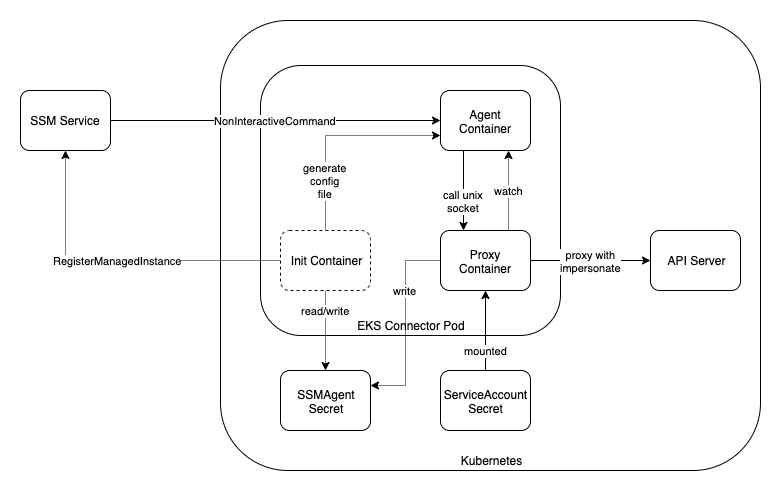

# EKS Connector

EKS Connector is a client-side agent that connects any Kubernetes cluster to AWS.

## How it works

EKS Connector runs in Kubernetes as a Pod that consists of below containers:

[source](https://drawio.corp.amazon.com?lightbox=1&highlight=0000ff&edit=_blank&layers=1&nav=1#RzVpdd6I6FP01PLYLiPjxaJ122tX2XjusdXvnMcIRMoXECbHq%2FPoJEoQY60erYl9KDick7LNz9knQQoN0%2Fp3jSfzMQkgs1w7nFvpmua7jeo78l1sWhaWNlCHiJFROlcEnf0AZbWWdkhAyzVEwlggy0Y0BoxQCodkw52ymu41Zoo86wREYBj%2FAiWl9JaGIC2vXsyv7PZAoLkd2bHUnxaWzMmQxDtmsZkK3FhpwxkRxlc4HkOTglbgU%2Fe4%2BuLuaGAcq9unQew1nozhGb0836L%2FHl%2Fvo5a13pZ7yjpOpemHff5YGH%2Fg7CUDNXCxKODib0hDyJzoWupnFRIA%2FwUF%2BdyYJIG2xSBN125xhORxwAfOaSc34O7AUBF9IF3W3rcBT7EElurMqFj1limthKLthFf1o9eAKIHmhMDoAL9fA63E6Ak5BSJJ%2BCawcEyJ5109IRKVtxIRg6XFQXIdR4mjA6LU24NjyTgVkywDy9tGXhkGxjhmX10MWXi6mKyqWmHY8A9OVTx1Tt3MqTMucWQNVvnzebUrJ3HLbiZzCzUhC247yq4wFbyAMiCGUGVA1GRcxixjFyW1lvamCYMtW5fPE2ERB%2FwuEWKh0jqeC6YGRsPPF%2F3n%2Fa9cr2z%2FV85aNb3OttVCtDwOXsSkPYAs4SIkH5hGILX7dwi8HYR8aLF9g2YNDggV513VjU4yXz%2Bpzjhc1hwkjVGS1oYa5oRrHs5FGt1ZrLdsf5i8vihms9S6nw8bjTFGjzsjV%2B3%2BepMjgaD%2BC5dhy6QtMKPDGVafVvTDZcUydlqABxwLMZS1LoTGJTPuYJKagn3Wxayv9uuPtWOwhzuJV1PPGEAshxXZpce2twd6ZD7w98wE6LB9c2deei7rnSAmo7eksbXlnX%2BL9Hy8vv7N%2F%2FbuRsJ9ef1GavN1vKJI4YCnldzNORMMUvD5Ibs7NwI1wOocz8DP0OydDzOrvB0Qkk9A%2BYyq3VOEDzQSmGzYgDZLFuTCybNvQ7STL3tz4km55RpwfKDmi1muQH0H4kasLf1k1NSf8bQPBCWfzxXJKckaGyJN0AjyTfG8m0X6e4N19Ce41xfCNmcwsZ5sXOcfS6iy30TprQ1yPpHJI%2Fl260JkJcIZFEDcsa53L0bV9l%2F2%2BZfiJd%2BGtrq4P62euh%2FnrJfqxdthdg3NDJRmXu8NuXGh7Bmj%2FMPpAJc9xkPNpwNIUU%2FM8ssH98660%2FvlFWX5oOfui%2FFqtZO4qUom9gEai9gX03T3hP%2FiosqMfGFyVp%2FsnTpquPqzn7Eia2%2F0%2FOteYr71U2XstY5zuZLOMW%2F1jWvEZrR8EORHNat2HgG84gW86G3vdprc9Zt3UHz5YxXfJC5Cvdq85%2BdpWPevfcdXB%2BoWSbn2vfULSyWb1nb1Y7tWvFdDtXw%3D%3D)

### init container

The init container is responsible for initiating the state of EKS Connector.

### proxy container

The proxy container is responsible for proxying Kubernetes API Server traffic and applying appropriate
user-impersonation flow.

### agent container

The agent container runs
the [AWS System Manager Agent](https://docs.aws.amazon.com/systems-manager/latest/userguide/ssm-agent.html). It
maintains a persistent, secure connection between the Kubernetes cluster and AWS.

## Development

As we plan to opensource this project, this project does not use Brazil for dependency management. It has
minimum `brazil-build` support which provides dry-run build for unit tests, coverage report and linters. The actual
CI/CD process will be done outside of builder tools.

### Brazil

[BrazilMakeGo](https://code.amazon.com/packages/BrazilMakeGo) is configured to test and lint the project with the
following __catches__:

- It does not build the actual binary
- Go module is turned off to avoid overriding the [go.mod](./go.mod) file.
- Brazil invokes [Makefile.brazil.mk](./Makefile.brazil.mk) instead of the standard [Makefile](Makefile).
- See [bmg.json](./bmg.json) for details.

### Updating dependencies

- `GOPROXY=direct go get -t <module>`
- `go mod vendor`
- development with new dependency
- `go mod tidy`
- commit vendor folder changes in a dedicated CR for easier review
- commit code changes in follow-up CR

## Release

[goreleaser](https://goreleaser.com/) is used to build EKS Connector.

CI/CD process to be added.

## Test

See [test/README.md](./test/README.md)